#  Realty Apartment

### *Modern Web-Based yang bisa mengatur sistem management apartement dengan efisiensi tinggi*

STATUS: Active | VERSION: 1.0 | FRAMEWORK: Laravel | TYPE: Final Project

---
## 1. Cara Penggunaan

# Warga # 

 1. Di Laman home klik " Login " 

 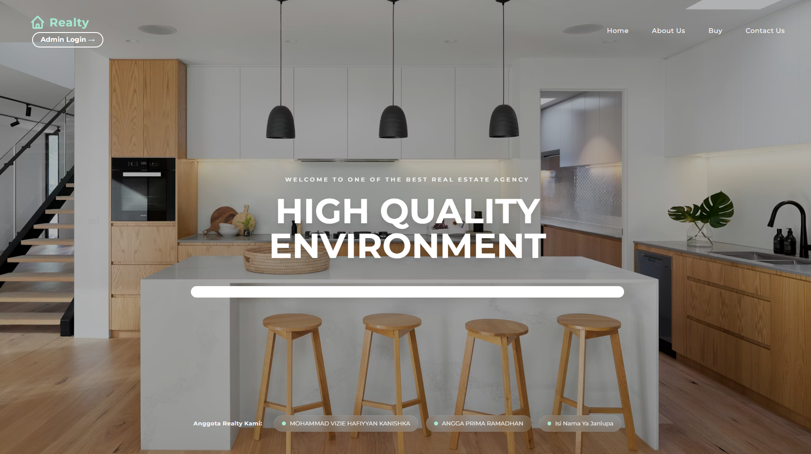

 2. Jika belum ada akun maka bisa " Register " Dulu

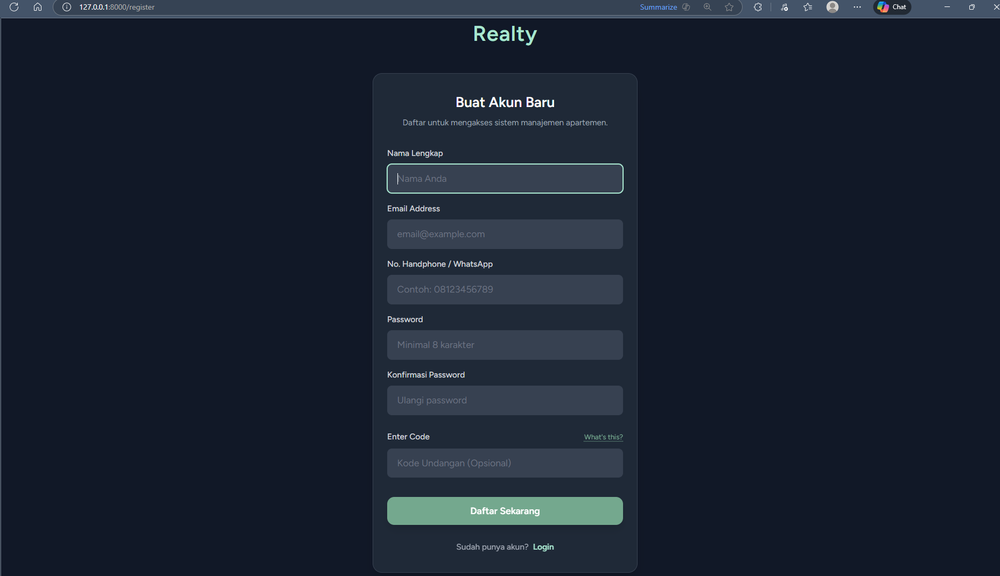

 3. Login menggunakan akun ( Contoh akun warga/ resident : ID : warga@gmail.com, PW : password)

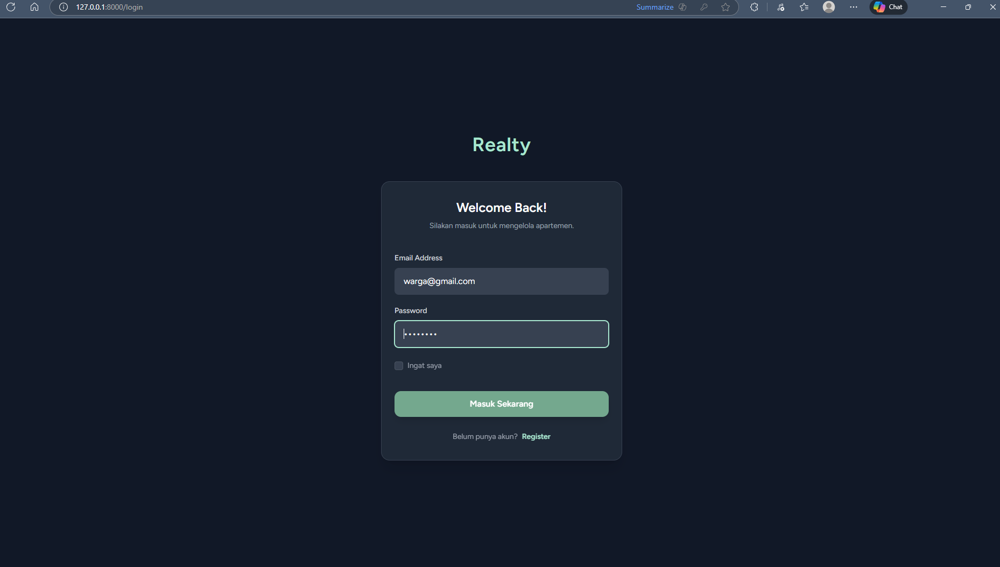

 4. Pengguna akan masuk ke halaman dashboard home, di bagian layout kiri bisa dilihat ada menu Home, Unit Hunian, Tagihan, Lapor Kerusakan.

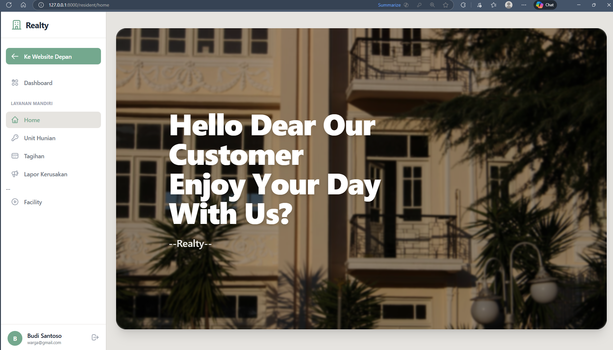

 5. Klik unit hunian dan pelanggan bisa lihat no hunian yang mereka miliki mulai dari tipe unit, no unit, lantai, tower. Dan jika belum maka akan tertulis belum memiliki 
  - Kalau Terisi : 
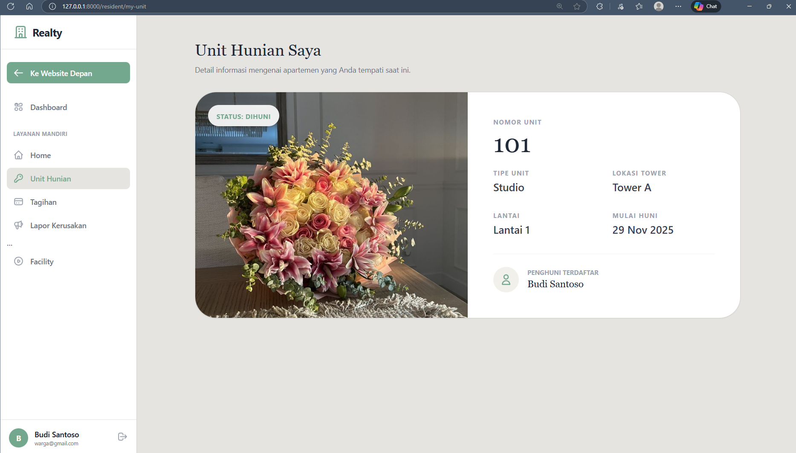

  - Kalau Kosong : 
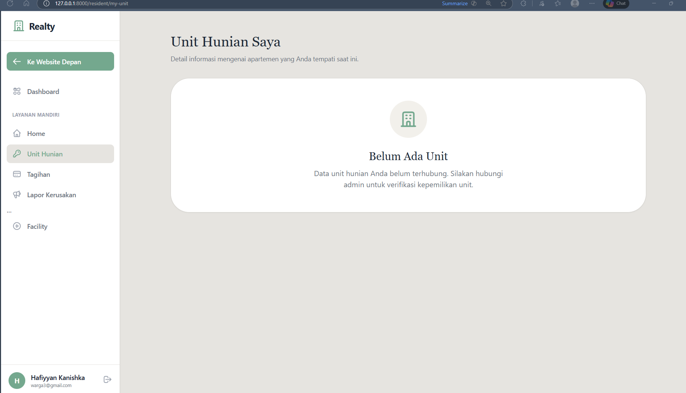

 6. Di menu " Tagihan " ada tagihan yang diberikan kepada pelanggan, terdapat tombol bayar sekarang dan pengguna akan diarahkan ke cara pembayaran dengan mengirim bukti gambar juga

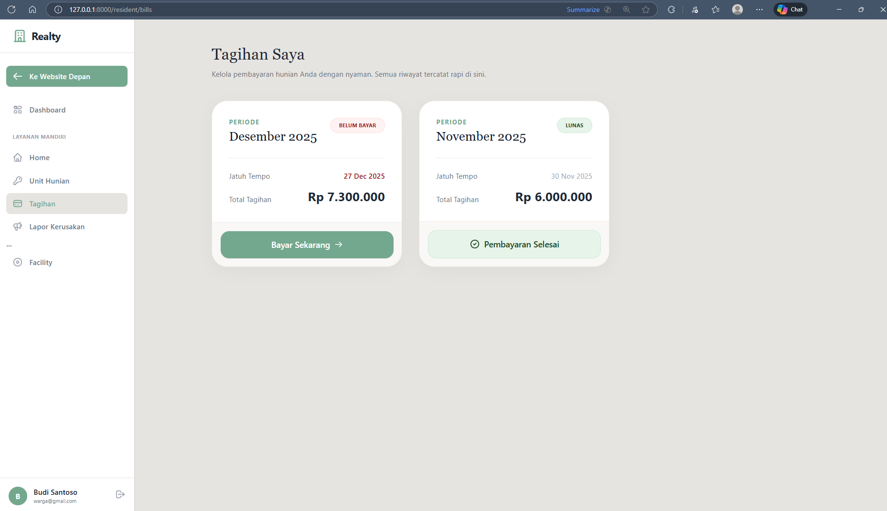

  - Klik Bayar Sekarang 

  - Menunggu verifikasi dari admin

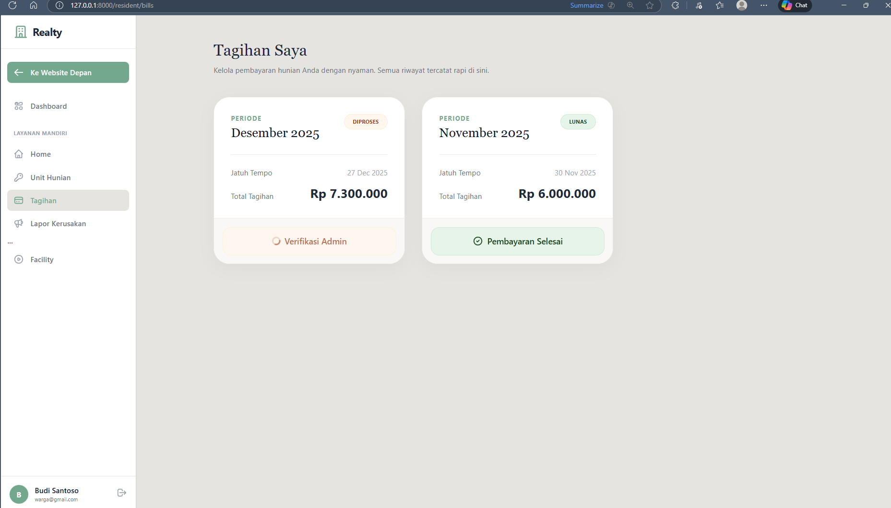

 7. Di menu " Lapor Kerusakan " pengguna bisa mengajukan laporan dengan mengisi judul masalah, deskripsi serta dilengkapi file yang bisa dikirimkan. Bila suidah terlaksana maka Status akan berubah jadi " Selesai " 

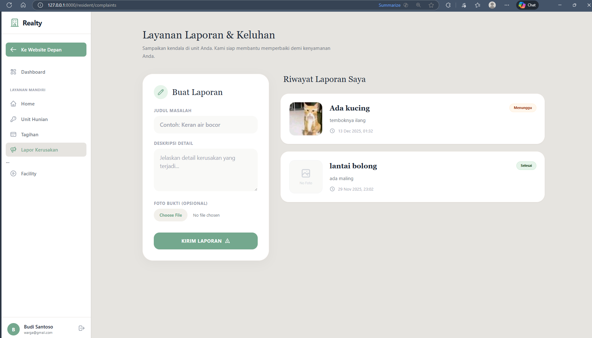

 8. Di menu " Facility " ada reservasi fasilitas untuk pelanggan jika ingin reserve lapangan tenis ataupun kolam renang, dilenkgapi dengna sistem secara real time membuat pelanggan bisa melihat jadwal waktu apa yang sudah dipesan oleh guest lain/ sedang maintenance. 
 Note : Apartemen hanya memiliki 1 lapangan tenis dan 1 kolam renang yang bisa tersedia dan bisa di reserve

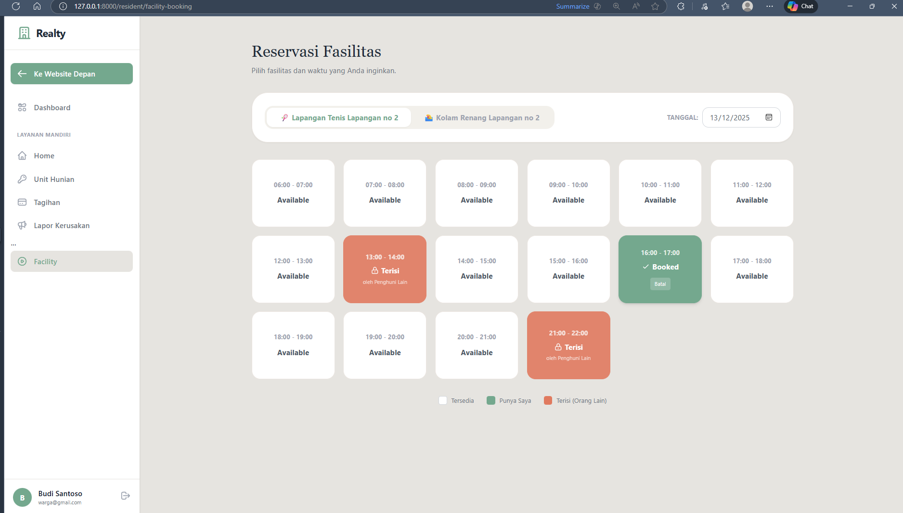

## 2. Features / Kegunaan

**Unit Management:** Mengatur apartment units & occupancy (CRUD).
**Resident Management:** Mengatur Resident management & registration (CRUD).
**Billing System:** Tagihan Bulanan, Receipt, Verifikasi pembayaran.
**Complaint System:** Untuk Komplan dari guest/ resident yang dilengkapi tanggal,foto untuk bukti.
**Facility Booking:** Sistem Booking (Tennis & Kolam Renang ) Dengan sistem waktu yang real time/live.
**Dashboard:** Admin dashboard yang dilengkapi statistik dari sistem.
**Security:** verifikasi authentication, session management, & role-based access control sesuai dari level aktor.
**Architecture:** menggunakan **MVC Architecture (Model-View-Controller)**.

## 3. List Path (Routes)

Dokumentasi *endpoint* atau jalur URL utama yang tersedia dalam aplikasi:

| Role      | Method    | Endpoint / Path     | Deskripsi |
| :---       | :---     | :---                | :--- |
| **Public** | GET      | `/`                 | Halaman Depan (Landing Page) |
| **Public** | GET      | `/facilities`       | Halaman Info Fasilitas  |
| **Auth**   | GET      | `/login`            | Halaman Masuk ke sistem  |
| **Auth**   | GET      | `/register`         | Pendaftaran penghuni baru |
| **Admin**  | GET      | `/admin/dashboard`  | Dashboard Utama Admin |
| **Admin**  | RESOURCE | `/admin/units`      | CRUD Unit Apartemen |
| **Admin**  | RESOURCE | `/admin/residents`  | CRUD Data Penghuni |
| **Admin**  | RESOURCE | `/admin/bills`      | Kelola Tagihan & Verifikasi |
| **Admin**  | GET      | `/admin/complaints` | Kelola Laporan Masuk |
| **Admin**  | GET      | `/admin/facilities` | Manajemen Jadwal Fasilitas |
| **Warga**  | GET      | `/resident/home`    | Dashboard Warga |
| **Warga**  | GET      | `/resident/my-unit` | Detail Unit Saya |
| **Warga**  | GET      | `/resident/bills`   | Lihat & Bayar Tagihan |
| **Warga**  | GET      | `/resident/facility-booking` | Booking Fasilitas |

## Preview

> A clean and modern interface to manage apartment units, residents, billing, facilities, and daily administrative activities — all in one streamlined platform.

## 1. Landing Page & Facility

## Demo Login Accounts

Untuk memudahkan pengujian (Testing), gunakan akun berikut:

Login sebagai Warga
1. Budi 
   **Email:** `warga@gmail.com` 
   **Password:** `password`

2. Vizie hafiyyan
   **Email:** `warga2@gmail.com`
   **Password:**`password`

Login sebagai Admin
* **Email:** `admin@gmail.com`
* **Password:** `password`
---

## Database Schema (ERD)

Sesuai persyaratan menggunakan **Relational Database Management System (RDBMS)** (MySQL), berikut adalah skema relasi antar tabel (User, Resident, Unit, Bills, Complaints, Facility Bookings) yang digunakan dalam project ini.

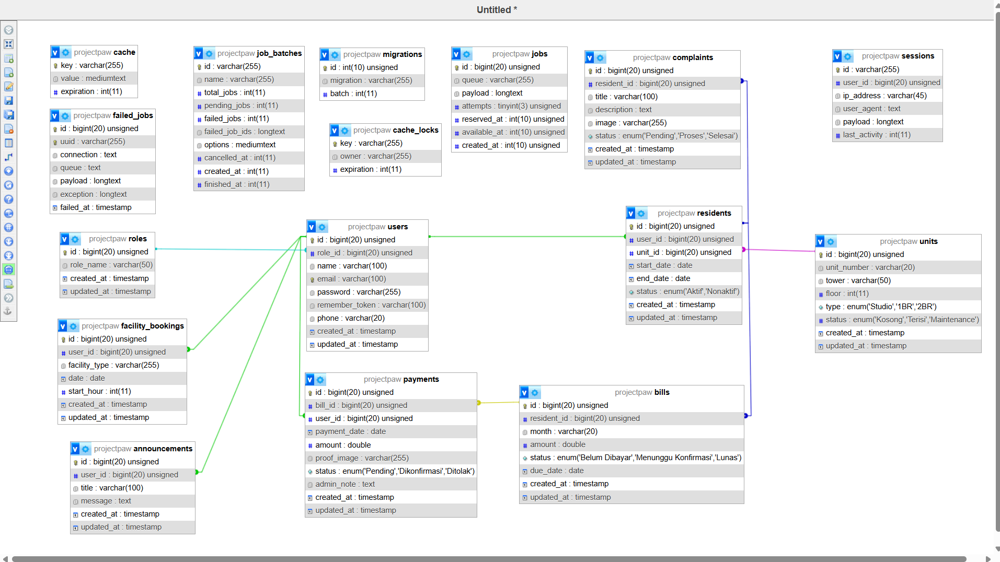
> **Catatan:** Gambar ini menunjukkan relasi Foreign Key antar tabel yang saling terhubung.

---

## Project Structure

RealtyApartment/
│── app/
│   ├── Http/Controllers/ (Controller Logic - MVC)
│   └── Models/ (Database Models - MVC)
│── bootstrap/
│── config/
│── database/
│   ├── migrations/
│   └── seeders/
│── public/
│── resources/
│   ├── views/ (Blade Templates - MVC)
│   ├── css/
│   └── js/
│── routes/ (Web Routes & Middleware)
│── storage/
│── tests/
└── vendor/

**Module**	    | **Description**
Unit Management	|  Mengatur unit apartemen & status hunian
Residents	Data  |  penghuni, kontrak, riwayat
Billing	        |  Tagihan bulanan + pembayaran
Complaints	    |  Keluhan fasilitas & tindak lanjut
Facilities	    |  Booking lapangan & kolam renang
Dashboard	      |  Statistik keuangan & occupancy

## Cara Installnya 

1. Clone Repository
git clone [https://github.com/Mangga123/Project_Akhir_PAW.git]
cd realtiy-apartment

2. Isntall Dependencies
composer install
npm install

3. Setup Enviroment
cp .env.example .env
php artisan key:generate

4. Setup Database
php artisan migrate --seed

5. Run Aplikas
php artisan serve
npm run dev

